<div align="center">

# 🏥 **ClaimBridge** 🏥

### **AI 기반 보험금 1차 심사 자동화 시스템** 
<br><br>

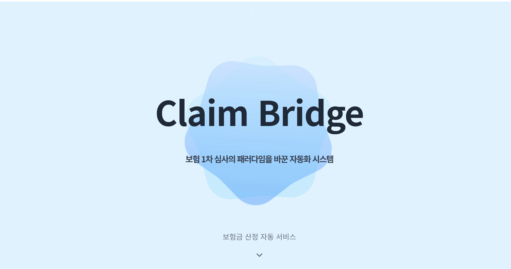

<br><br>
💡 보험 1차 심사의 패러다임을 바꾼 ClaimBridge을 경험해보세요!
<br><br>

</div>


<br><br>

# 📖 Table of contents

* [Introduction](#-introduction)
* [Demo](#-demo)
* [API](#-api)
* [System Architecture](#-system-architecture)
* [ERD](#-erd)
* [Tech Stack](#-tech-stack)
* [Monitoring](#-monitoring)
* [How to start](#-how-to-start)
* [Directory Structure](#-directory-structure)
* [Team Members](#-team-members)
<br><br>

# 📣 Introduction

### 🖥️ ClaimBridge

> URL : [ClaimBridge.World](https://claimbridge.world)

### 🔎 ClaimBridge Medium 

> URL : [ClaimBridge_Medium](https://medium.com/@ksoohyy/claim-bridge-%EB%B3%B4%ED%97%98-1%EC%B0%A8-%EC%8B%AC%EC%82%AC%EC%9D%98-%ED%8C%A8%EB%9F%AC%EB%8B%A4%EC%9E%84%EC%9D%84-%EB%B0%94%EA%BE%BC-%EC%9E%90%EB%8F%99%ED%99%94-%EC%8B%9C%EC%8A%A4%ED%85%9C-2025-siliconvalley-summer-bootcamp-5a3e33289a58)


### 주요 기능

* **🤖 AI 기반 OCR 처리**: Upstage AI Information Extraction API를 활용한 진단서/영수증 이미지에서 텍스트 자동 추출 및 구조화된 데이터 변환
* **🔍 딥러닝 기반 위조분석**: ResNet18 + ELA(Error Level Analysis) 기술을 활용한 문서 위조 여부 분석 (정확도 93%+)
* **💰 지능형 보험금 계산**: 진단명 키워드 매칭 및 보험상품별 특약 자동 적용을 통한 정확한 보험금 산정
* **📄 AI 기반 PDF 조항 추출**: OpenAI GPT-4를 활용한 보험 약관 PDF에서 특약별 보장내용, 지급금액, 최대한도 자동 추출
* **📊 실시간 관리자 대시보드**: Chart.js 기반 시각화를 통한 청구 현황 분석 및 승인/거부 워크플로우 관리
* **📈 엔터프라이즈급 모니터링**: Prometheus 메트릭 수집, Jaeger 분산 추적, cAdvisor 컨테이너 모니터링을 통한 시스템 성능 실시간 추적
  
<br><br>


# 🕺🏻 Demo

### Onboarding

> ClaimBridge의 간략한 설명을 담고 있습니다.


### Upload Page

> 진단서와 영수증 이미지를 업로드하여 AI 분석을 시작할 수 있습니다.


### Analysis Page

> AI가 분석한 결과를 확인하고 보험금 청구를 진행할 수 있습니다.


### Edit Page

> 병원 영수증 및 진단서에서 OCR로 추출된 내용이 잘못된 경우, 이 페이지에서 직접 수정할 수 있으며, 이미지가 안 보일 경우 돋보기 기능을 통해 확대하여 정확하게 확인할 수 있습니다.


### Login & Sign up

> JWT 기반 인증을 통해 안전하게 로그인하실 수 있습니다.


### Management Page

> 관리자는 모든 청구 건을 관리하고 승인/거부할 수 있습니다.

Management

### Report Page

> 차트와 통계를 통해 청구 현황을 분석할 수 있습니다.

Report

<br><br>

# 📗 API

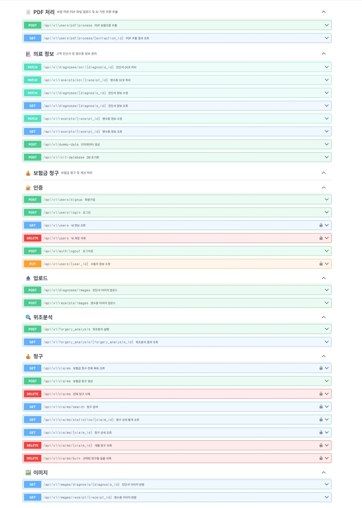

<a name="-system-architecture"></a>

<br><br>

# 🛠️ System Architecture

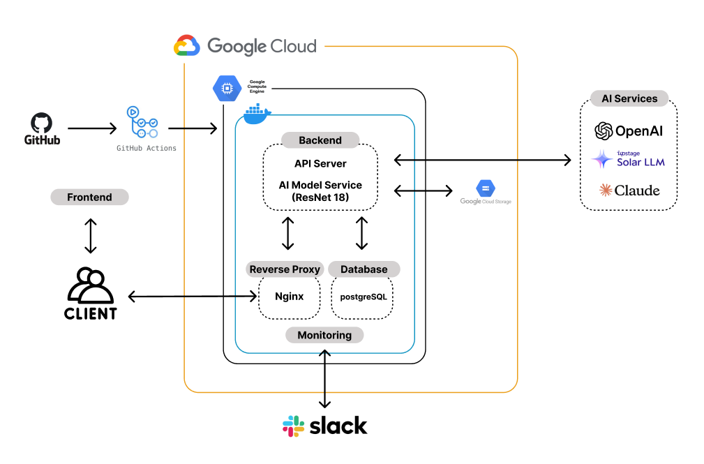

<br><br>

# 🔑 ERD


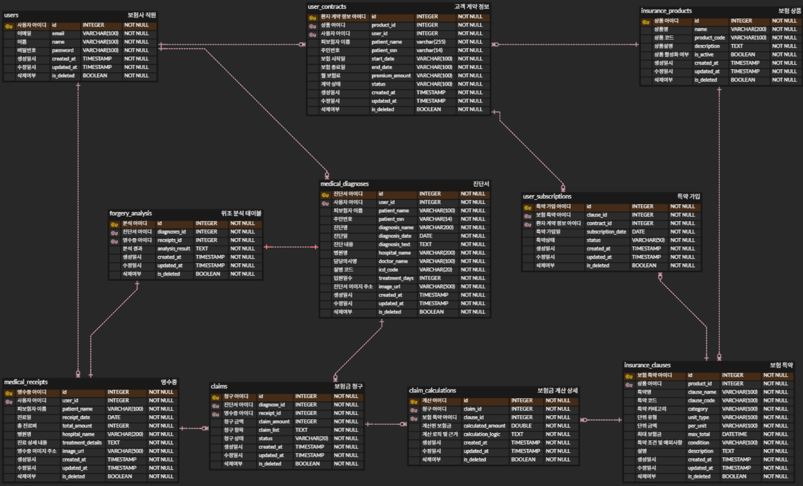


<br><br>


# 💻 Tech Stack

| Field          | Technology of use                                                                                                                                                                                                                                                                                                                                                                                                                                                                                                                     |
| -------------- | ------------------------------------------------------------------------------------------------------------------------------------------------------------------------------------------------------------------------------------------------------------------------------------------------------------------------------------------------------------------------------------------------------------------------------------------------------------------------------------------------------------------------------------- |
| **Frontend**   |         |
| **Backend**    |        |
| **Database**   |    |
| **DevOps**     |     |
| **Monitoring** |       |
| **AI/ML**      |      |


<br><br>


# 📊 Monitoring


<table>
<tr>
    <td colspan="2" align="center"><b>cAdvisor</b></td>
  </tr>
  <tr>
    <td>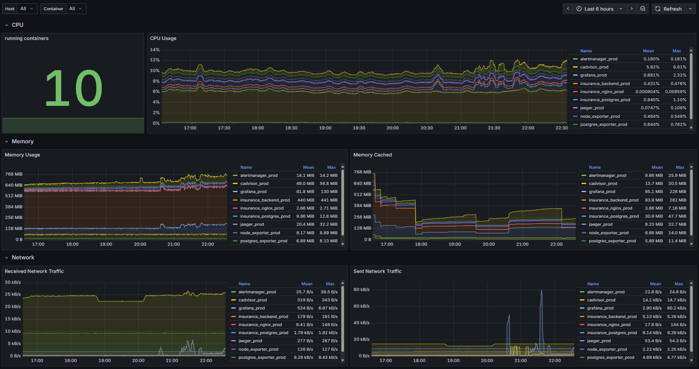</td>
    <td>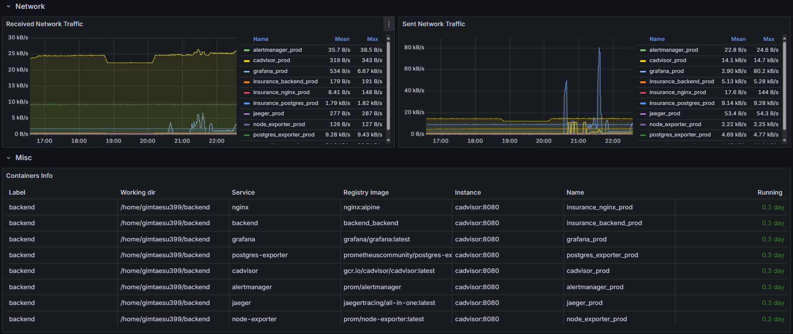</td>
  </tr>
         
  <tr>
    <td colspan="2" align="center"><b>FastAPI</b></td>
  </tr>
  <tr>
    <td>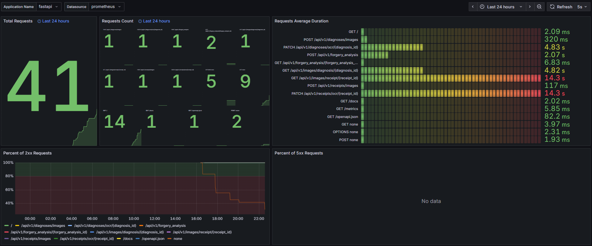</td>
    <td>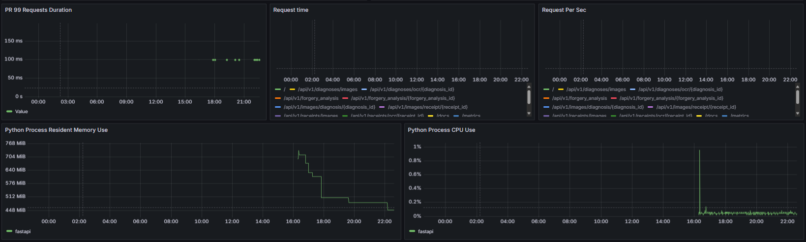</td>
  </tr>
         
  <tr>
    <td colspan="2" align="center"><b>Node Exporter</b></td>
  </tr>
  <tr>
    <td>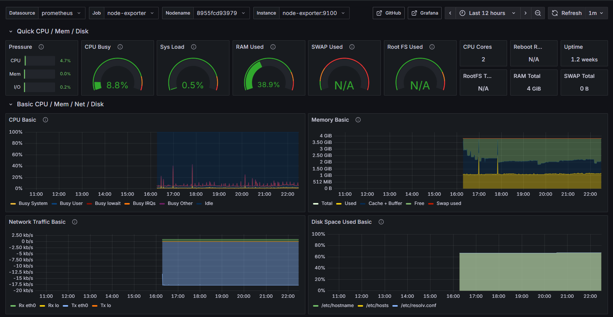</td>
    <td>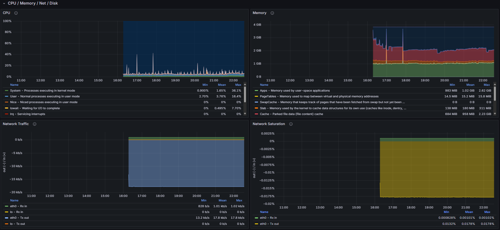</td>
  </tr>
  <tr>
    <td colspan="2" align="center"><b>PostgreSQL</b></td>
  </tr>
  <tr>
    <td>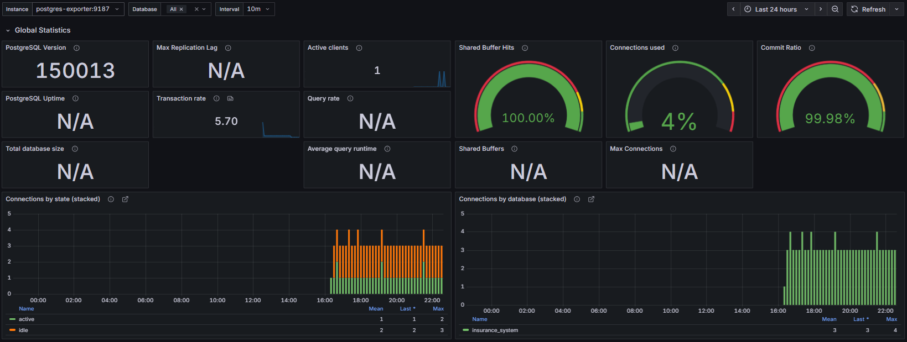</td>
    <td>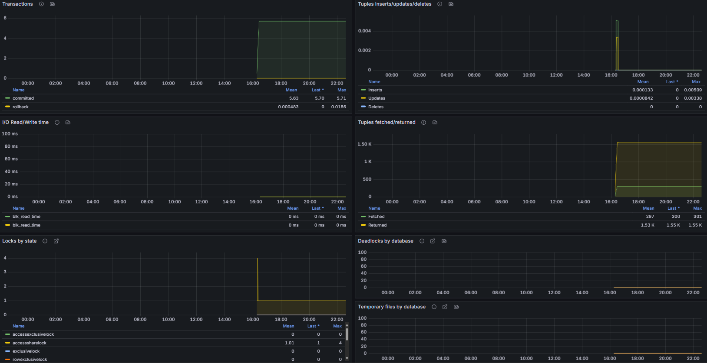</td>
  </tr>
         
</table>


<br><br>


# 🚀 How to start

### 1. 프로젝트 클론
```bash
git clone https://github.com/your-username/claimbridge.git
cd claimbridge
```

### 2. Backend 설정 및 실행

```bash
# Backend 디렉토리로 이동
cd backend

# 환경변수 설정
cp env.example .env
# .env 파일에서 실제 API 키 등으로 수정

# Docker Compose로 실행
docker-compose up -d --build

# 더미데이터 생성 (선택사항)
docker exec -it insurance_backend python utils/scripts/create_final_dummy_data.py
```

### 3. Frontend 설정 및 실행

```bash
# Frontend 디렉토리로 이동
cd frontend

# 의존성 설치
npm install

# 환경변수 설정
echo "VITE_API_BASE_URL=http://localhost:8000/api/v1" > .env

# 개발 서버 실행
npm run dev
```


<br><br>


# 📁 Directory Structure

<details>
<summary>ClaimBridge-Backend</summary>
         
```
🗂️ Backend
┣ 📃 Dockerfile  
┣ 📃 Dockerfile.prod  
┣ 📃 main.py  
┣ 📃 README.md  
┣ 📃 requirements.txt  
┣ 📃 resnet18_ela.pth  
┣ 📃 TEAM_GUIDE.md  
┣ 📃 가이드.md  

┣ 🗂️ api  
┃ ┣ 📃 auth.py  
┃ ┣ 📃 claims.py  
┃ ┣ 📃 forgeries.py  
┃ ┣ 📃 image.py  
┃ ┣ 📃 medical.py  
┃ ┣ 📃 ocr.py  
┃ ┣ 📃 pdf.py  
┃ ┣ 📃 upload.py  
┃ ┗ 📃 __init__.py  

┣ 🗂️ input_pdfs  
┃ ┣ 📃 삼성생명_스마트보장보험.pdf  
┃ ┣ 📃 삼성생명_실손의료비보장보험.pdf  
┃ ┗ 📃 삼성생명_희망사랑보험.pdf  

┣ 🗂️ models  
┃ ┣ 📃 database.py  
┃ ┣ 📃 models.py  
┃ ┣ 📃 schemas.py  
┃ ┗ 📃 __init__.py  

┣ 🗂️ output_results  
┃ ┣ 📃 삼성생명_스마트보장보험_extracted_clauses.json  
┃ ┣ 📃 삼성생명_실손의료비보장보험_extracted_clauses.json  
┃ ┗ 📃 삼성생명_희망사랑보험_extracted_clauses.json  

┣ 🗂️ services  
┃ ┣ 📃 ai_config.py  
┃ ┣ 📃 claim_calculator.py  
┃ ┣ 📃 forgery_detector.py  
┃ ┣ 📃 forgery_service.py  
┃ ┣ 📃 pdf_processor.py  
┃ ┣ 📃 storage_service.py  
┃ ┗ 📃 __init__.py  

┣ 🗂️ tests  
┃ ┣ 📃 test_auth.py  
┃ ┣ 📃 test_claims_api.py  
┃ ┣ 📃 test_claims.py  
┃ ┣ 📃 test_forgery.py  
┃ ┣ 📃 test_models.py  
┃ ┣ 📃 test_pdf.py  
┃ ┣ 📃 test_utils.py  
┃ ┗ 📃 __init__.py  

┣ 🗂️ uploads  
┃ ┣ 🗂️ diagnosis  
┃ ┗ 🗂️ receipts  

┣ 🗂️ utils  
┃ ┣ 📃 auth.py  
┃ ┣ 📃 ela.py  
┃ ┣ 🗂️ scripts  
┃ ┃ ┣ 📃 create_final_dummy_data.py  
┃ ┃ ┣ 📃 ela_dataloader_test.py  
┃ ┃ ┣ 📃 ela_dataset.py  
┃ ┃ ┣ 📃 make_ela_dataset.py  
┃ ┃ ┣ 📃 test_setup.py  
┃ ┃ ┗ 📃 train_resnet18_ela.py  
┃ ┣ 🗂️ sql  
┃ ┃ ┗ 📃 init_database.sql  

🗂️ deploy  
┣ 📃 aws-deploy.sh  
┣ 📃 gcp-deploy.sh  
┗ 📃 배포.md  

🗂️ docs  
┣ 📃 Architecture.md  
┗ 📃 ERD.md  

🗂️ nginx  
┣ 📃 nginx.conf  
┣ 📃 nginx.prod.conf  
┗ 🗂️ ssl  

```

</details>

<details>
<summary>ClaimBridge-Frontend</summary>
         
```
🗂️ frontend
├── 🗂️ .github
│   └── 🗂️ ISSUE_TEMPLATE
├── 🗂️ public
│   └── 📃 robots.txt
├── 🗂️ src
│   ├── 🗂️ assets
│   │   ├── 🗂️ Analysis
│   │   ├── 🗂️ fonts
│   │   ├── 🗂️ Navbar
│   │   ├── 🗂️ Onboarding
│   │   └── 🗂️ Upload
│   ├── 🗂️ components
│   │   ├── 🗂️ buttons
│   │   ├── 📃 Container.jsx
│   │   ├── 📃 LoadingOverlay.jsx
│   │   ├── 📃 Navbar.jsx
│   │   └── 📃 Textinput.jsx
│   ├── 🗂️ config
│   │   └── 📃 api.js
│   ├── 🗂️ hooks
│   │   └── 📃 useAPI.js
│   ├── 🗂️ pages
│   │   ├── 📃 Analysis.jsx
│   │   ├── 📃 Complete.jsx
│   │   ├── 📃 Diagnosis_edit.jsx
│   │   ├── 📃 Login.jsx
│   │   ├── 📃 Management.jsx
│   │   ├── 📃 Onboarding.jsx
│   │   ├── 📃 Receipt_edit.jsx
│   │   ├── 📃 Report.jsx
│   │   ├── 📃 Signup.jsx
│   │   └── 📃 Upload.jsx
│   ├── 🗂️ services
│   │   ├── 📃 apiClient.js
│   │   ├── 📃 authAPI.js
│   │   ├── 📃 claimsAPI.js
│   │   ├── 📃 diagnosisAPI.js
│   │   ├── 📃 forgeryAPI.js
│   │   ├── 📃 index.js
│   │   └── 📃 receiptAPI.js
│   ├── 🗂️ styles
│   │   └── 📃 GlobalStyle.js
│   ├── 📃 App.jsx
│   └── 📃 main.jsx
├── 📃 .env
├── 📃 .gitignore
├── 📃 .prettierrc
├── 📃 eslint.config.js
├── 📃 index.html
├── 📃 package-lock.json
├── 📃 package.json
├── 📃 README.md
├── 📃 vercel.json
└── 📃 vite.config.js

```
</details>


<br><br>


# 👥 Team Members

|            | 최일우 | 오유민 | 김다현 | 김태수 | 윤일환 | 김수현 |
|------------|:------:|:------:|:------:|:------:|:------:|:------:|
| **Profile** |  |  |  |  |  |  |
| **Role**    | Team Leader<br>Frontend<br>DevOps | Frontend<br>UI/UX | Frontend<br>UI/UX | Backend<br>DevOps | Backend<br>DevOps | Backend<br>DevOps |
| **GitHub**  | [@Il-Woo-Choi](https://github.com/Il-Woo-Choi) | [@ohyoom](https://github.com/ohyoom) | [@dadazure](https://github.com/dadazure) | [@gimtaesu399](https://github.com/gimtaesu399) | [@oao03](https://github.com/oao03) | [@SoohyunKim123](https://github.com/SoohyunKim123) |

---

<div align="center">

**ClaimBridge** - AI 기반 보험금 1차 심사 자동화 시스템

더 빠르고 정확한 보험금 심사를 경험해보세요! 🏥✨

</div>
